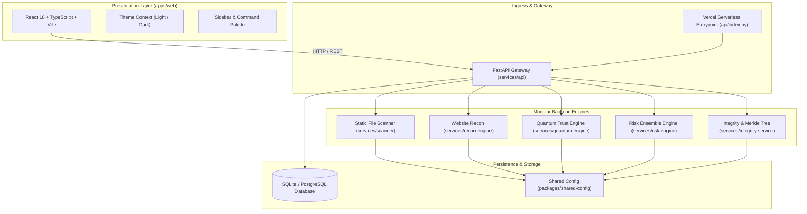

# NeuroCraft

<div align="center">

```
  _   _                      ____            __ _   
 | \ | | ___ _   _ _ __ ___ / ___|_ __ __ _ / _| |_ 
 |  \| |/ _ \ | | | '__/ _ \ |   | '__/ _` | |_| __|
 | |\  |  __/ |_| | | | (_) | |___| | | (_| |  _| |_ 
 |_| \_|\___|\__,_|_|  \___/ \____|_|  \__,_|_|  \__|
```

### *Detect. Verify. Prove.*

**AI-Assisted Multi-Engine Cybersecurity Analysis, Post-Quantum Trust Verification & Verifiable Provenance**

[](https://python.org)
[](https://fastapi.tiangolo.com)
[](https://react.dev)
[](https://www.typescriptlang.org)
[](https://tailwindcss.com)
[](./tests)
[](https://vercel.com)
[](./LICENSE)

[Features](#-features) • [Architecture](#-architecture) • [Getting Started](#-getting-started) • [API Reference](#-api-reference) • [Vercel Deployment](#-vercel-deployment) • [Security](#-security-principles)

</div>

---

## 1. Overview

**NeuroCraft** is an open-source, multi-engine cybersecurity analysis platform that bridges the gap between deterministic binary inspection, network reconnaissance, and post-quantum cryptographic resilience.

Instead of issuing opaque, black-box verdicts, NeuroCraft:
1. **Detects** malicious indicators, packed payloads, high-entropy anomalies, and suspicious binary structures.
2. **Verifies** digital signatures, SSL/TLS certificate chains, HTTP security headers, and post-quantum cryptographic resistance.
3. **Proves** its findings with structured evidence schemas, explainable rationale, and tamper-evident SHA-256 Merkle root trees.

---

## 2. Core Engines & Capabilities

### 🛡️ 1. Static Binary Analysis Engine (`services/scanner`)
* **Zero-Execution Inspection**: Safely inspects untrusted files out-of-process without executing malicious code.
* **Format & Magic Byte Fingerprinting**: Validates true binary signatures (PE, ELF, Mach-O, ZIP, PDF) rather than trusting client-supplied file extensions.
* **Entropy & Anomaly Detection**: Calculates Shannon byte entropy across binary sections to identify packed, encrypted, or obfuscated payloads.
* **Authenticode & Signature Verification**: Inspects embedded certificates, countersignatures, and detects unsigned or tampered executables.
* **Boundary Enforcement**: Decompression bomb mitigation (zip-bomb expansion ratios, recursion limits, and size ceilings).

### 🌐 2. Website Reconnaissance Engine (`services/recon-engine`)
* **DNS Intelligence**: Resolves and maps A, AAAA, MX, NS, and TXT DNS records.
* **SSL/TLS Certificate Chain Analysis**: Inspects TLS version, cipher strength, certificate validity dates, subject common names, and issuer authority.
* **HTTP Security Header Audit**: Verifies critical defensive headers including `Strict-Transport-Security` (HSTS), `Content-Security-Policy` (CSP), `X-Frame-Options`, `X-Content-Type-Options`, and `Referrer-Policy`.
* **Exposure Risk Score**: Synthesizes open surface findings into an actionable exposure metric [0–100].

### ⚛️ 3. Post-Quantum Trust Engine (`services/quantum-engine`)
* **NIST PQC Standards Simulation**: Compares classical public-key cryptography (RSA-2048, RSA-4096, ECC P-256) against post-quantum lattice-based algorithms (CRYSTALS-Dilithium, Falcon, SPHINCS+).
* **Quantum Adversary Simulation**: Evaluates cryptographic defenses under active attack scenarios:
  * `LEGITIMATE`: Standard authenticated transmission baseline.
  * `FORGERY`: Shor's algorithm signature forgery simulation.
  * `REPLAY`: Recorded ciphertext injection across quantum transport.
  * `IMPERSONATION`: Identity substitution in public-key exchange.
  * `CHANNEL_MANIPULATION`: Man-in-the-middle transit tampering.
* **Quantum Vulnerability Index (QVI)**: Quantifies cryptographic risk to help organizations plan Post-Quantum Migration.

### ⚖️ 4. Deterministic Risk Ensemble (`services/risk-engine`)
* **Deterministic Separation**: Keeps deterministic findings (signatures, hashes, header validation) strictly separated from heuristic approximations.
* **Calibrated Scoring**: Outputs normalized risk scores [0–100] categorized into `SAFE`, `LOW`, `MEDIUM`, `HIGH`, and `CRITICAL`.
* **Confidence & Fallback**: Distinguishes between clean files and unclassified inputs with explicit `UNKNOWN` handling.

### 📜 5. Integrity & Provenance Ledger (`services/integrity-service`)
* **SHA-256 Merkle Root Trees**: Cryptographically binds analysis evidence items into verifiable tree structures.
* **Tamper-Evident Non-Repudiation**: Guarantees scan results cannot be quietly edited or falsified after the fact.
* **Exportable Reports**: Produces comprehensive JSON and Markdown audit reports with complete cryptographic provenance.

### 💻 6. Modern Web Application (`apps/web`)
* **Crisp SaaS Design System**: Built with React 18, TypeScript, and Tailwind CSS.
* **Dual-Theme Support**: Flawless light and dark theme persistence with CSS variable tokens.
* **Collapsible Desktop Sidebar**: Quick-access favorites, smooth collapse toggle, and popover tooltips.
* **Live Visualizations**: Responsive AreaCharts for safety trends, animated count-up metrics, and interactive tabs.
* **Global Command Palette**: Instant navigation via keyboard shortcut (`Cmd+K` or `Ctrl+K`).

---

## 3. Architecture

NeuroCraft uses a modular monorepo architecture with clean public contracts:



---

## 4. Getting Started

### Prerequisites
* **Python**: 3.12 or newer (tested on Python 3.14)
* **Node.js**: 18.0 or newer (tested on Node 24)
* **Git**: 2.40 or newer

### 1. Clone the Repository
```bash
git clone https://github.com/nakul09i/NeuroCraft.git
cd NeuroCraft
```

### 2. Configure Environment
```bash
# Copy example configuration template
cp .env.example .env
```

### 3. Backend Setup
```bash
# Create and activate Python virtual environment
python -m venv .venv

# On Linux / macOS:
source .venv/bin/activate

# On Windows (PowerShell):
.\.venv\Scripts\Activate.ps1

# Install dependencies in editable mode
pip install -r requirements.txt
```

### 4. Frontend Setup
```bash
cd apps/web
npm install
cd ../..
```

### 5. Running the Application Locally

#### Option A: Run Backend & Frontend Concurrently
**Terminal 1 — Backend API:**
```bash
# From repository root (with .venv active):
uvicorn neurocraft_api.main:app --reload --host 127.0.0.1 --port 8000
```
API Documentation will be available at [http://127.0.0.1:8000/docs](http://127.0.0.1:8000/docs).

**Terminal 2 — Frontend UI:**
```bash
cd apps/web
npm run dev
```
Web application will be accessible at [http://localhost:5173](http://localhost:5173).

#### Option B: Unified Production Serving
Build the frontend bundle once, and FastAPI will automatically serve the static SPA:
```bash
cd apps/web
npm run build
cd ../..
uvicorn neurocraft_api.main:app --host 127.0.0.1 --port 8000
```
Open [http://127.0.0.1:8000](http://127.0.0.1:8000) directly in your browser.

---

## 5. API Reference

All API routes are served under the `/api/v1` namespace. Interactive OpenAPI / Swagger UI is available at `/docs`.

| Method | Endpoint | Description |
| :--- | :--- | :--- |
| `GET` | `/health` | Ingress health probe. |
| `GET` | `/api/v1/health` | Comprehensive service health status. |
| `GET` | `/api/v1/dashboard/stats` | High-level metrics, scan counts, and recent activity. |
| `POST` | `/api/v1/scans` | Upload and analyze a binary file (`multipart/form-data`). |
| `GET` | `/api/v1/scans/{id}` | Retrieve detailed file scan evidence and risk score. |
| `POST` | `/api/v1/recon` | Perform domain/website reconnaissance (`{"target": "example.com"}`). |
| `POST` | `/api/v1/quantum/simulations` | Execute post-quantum trust simulation for an algorithm and scenario. |
| `POST` | `/api/v1/reports` | Generate a signed JSON or Markdown security report. |
| `POST` | `/api/v1/auth/register` | Register a new user profile. |
| `POST` | `/api/v1/auth/login` | Authenticate and obtain a JWT bearer token. |

### Example: Running a Static File Scan
```bash
curl -X POST "http://127.0.0.1:8000/api/v1/scans" \
  -H "accept: application/json" \
  -F "file=@sample.exe"
```

### Example: Running a Website Reconnaissance Check
```bash
curl -X POST "http://127.0.0.1:8000/api/v1/recon" \
  -H "Content-Type: application/json" \
  -d '{"target": "google.com"}'
```

---

## 6. Vercel Deployment

NeuroCraft is pre-configured for frictionless zero-config deployment to **Vercel** as a hybrid Serverless Application:
* The **FastAPI API** is served as Python serverless functions via `api/index.py`.
* The **React Frontend** is built and served via `apps/web/dist`.
* Routes are cleanly orchestrated via `vercel.json`.

### Deploying via Vercel CLI
```bash
npm i -g vercel
vercel
```

### Deploying via GitHub Integration
1. Push your repository to GitHub.
2. In the Vercel Dashboard, import the repository.
3. Configure the following environment variables if needed:
   * `DATABASE_URL`: Defaults to `sqlite:////tmp/neurocraft.db` in serverless environments.
   * `APP_SECRET_KEY`: Set a secure 32+ character random string for production sessions.
4. Click **Deploy**. Vercel will automatically build the web assets and deploy the serverless Python functions.

---

## 7. Testing & Quality Assurance

NeuroCraft maintains a rigorous test suite spanning unit logic, integration workflows, and security boundary defenses:

```bash
# Run the complete test suite with pytest
pytest tests

# Run specific test tiers
pytest tests/unit
pytest tests/integration
pytest tests/security

# Run frontend type checking & build verification
cd apps/web
npm run build
```

### Test Coverage Highlights
* `tests/unit/`: File type detection, SHA-256 fingerprinting, Authenticode validation, risk engine aggregation, quantum simulation, and auth logic.
* `tests/integration/`: End-to-end scan lifecycle, recon workflows, and tenant isolation.
* `tests/security/`: Path traversal fuzzing, symlink protection, decompression bomb prevention, and secret redaction.

---

## 8. Security Principles

1. **Zero Execution of Untrusted Files**: Static analysis is strictly out-of-process. Files are never executed during scanning.
2. **Decompression Bomb Defense**: Enforces strict expansion ratio checks and recursion depth limits (default max depth: 2).
3. **Strict Path Sanitization**: Strips path traversal characters (`../`, `..\\`) and prevents symlink escape attacks.
4. **Offline First-Class Operation**: All core scanning, hashing, and ML capabilities work offline without internet access.
5. **No Secret Commits**: Sensitive keys, credentials, and live malware binaries are barred from the repository via strict `.gitignore` rules.

---

## 9. Monorepo Directory Structure

```
neurocraft/
├── api/                         # Vercel serverless entrypoint (index.py)
├── apps/
│   ├── web/                     # React 18 + Vite + Tailwind CSS frontend
│   └── cli/                     # Python CLI tool (future)
├── services/
│   ├── api/                     # FastAPI HTTP REST gateway
│   ├── scanner/                 # Static binary inspection & fingerprinting
│   ├── recon-engine/            # DNS, SSL/TLS, and security header recon
│   ├── quantum-engine/          # Post-quantum cryptography simulation
│   ├── risk-engine/             # Multi-engine score aggregation
│   └── integrity-service/       # SHA-256 Merkle tree & provenance ledger
├── packages/
│   ├── shared-types/            # Pydantic schemas and shared data models
│   ├── shared-config/           # Centralized settings & environment models
│   ├── shared-security/         # Path sanitizers and safe extractors
│   ├── shared-logging/          # Structured JSON logging & secret redaction
│   └── api-client/              # Type-safe API client
├── tests/                       # Unit, integration, and security test suites
├── vercel.json                  # Production Vercel routing configuration
├── pyproject.toml               # Python project configuration & dependencies
└── requirements.txt             # Locked Python dependencies
```

---

## 10. Contributing

We welcome contributions from developers, cybersecurity researchers, and students!
1. Fork the repository.
2. Create a feature branch (`git checkout -b feat/quantum-dilithium-upgrade`).
3. Ensure all tests pass (`pytest tests && cd apps/web && npm run build`).
4. Commit your changes following Conventional Commits (`feat:`, `fix:`, `docs:`).
5. Open a Pull Request.

---

## 11. Disclaimer

*NeuroCraft is an educational and defensive cybersecurity analysis platform. It does not provide absolute guarantees of malware detection or complete security immunity. Detection scores represent statistical and heuristic assessments, not definitive legal or forensic proof. Never use this platform for unauthorized inspection or offensive operations.*

---

<div align="center">
  <sub>Designed & Developed with ❤️ by the NeuroCraft Team • 2026</sub>
</div>
