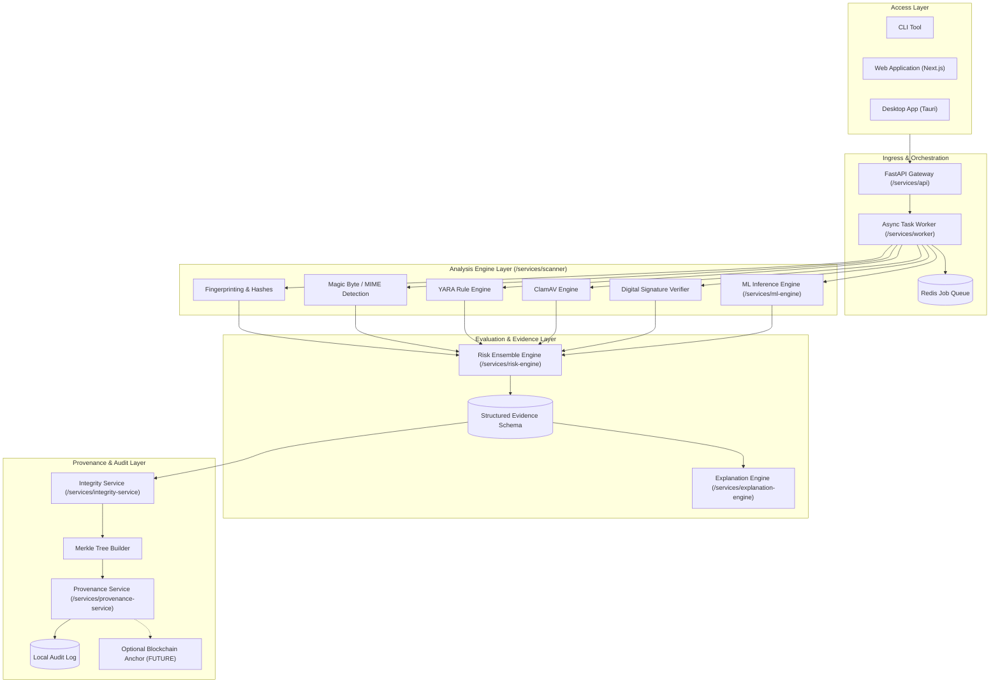

# NeuroCraft

> **Detect. Verify. Prove.**

An AI-assisted, multi-layer cybersecurity platform designed to analyze untrusted files, detect potentially malicious artifacts, verify digital signatures, identify tampering, synthesize explainable security evidence, and maintain tamper-evident cryptographic provenance records.

---

## 1. Overview

**NeuroCraft** provides an end-to-end security analysis pipeline that combines traditional deterministic controls (cryptographic hashing, signature validation, YARA pattern matching, and ClamAV heuristics) with modern machine learning classifiers and explainable AI. Rather than treating security verdicts as a black box, NeuroCraft gathers verifiable structural evidence from multiple independent engines, weighs them through a transparent risk model, and cryptographically seals the audit trail via Merkle trees and optional decentralized provenance anchoring.

---

## 2. The Problem

Modern malware and supply-chain attacks increasingly exploit blind spots in conventional endpoint and gateway defenses:

* **Black-Box Detection**: Contemporary antivirus and ML tools often issue opaque "Malicious / Clean" decisions without providing inspectable indicators or defensible rationale.
* **Format & Evasion Vulnerabilities**: Malicious actors craft polyglots, packed binaries, and malformed headers to evade static signatures while crashing or bypassing heuristic scanners.
* **Weak Auditability & Tampering**: Forensic logs and scan reports are easily modified or disputed after an incident, lacking non-repudiation and cryptographic chain-of-custody.
* **High Barrier to Entry**: Advanced threat intelligence and commercial sandbox platforms often mandate expensive enterprise licensing, leaving students, researchers, and resource-constrained defenders without accessible, high-grade tooling.

---

## 3. Vision

NeuroCraft delivers a unified, **free-first**, and modular platform where security analysts, developers, and researchers can:

1. **Detect** malicious indicators with multi-layer deterministic and machine-learning models.
2. **Verify** cryptographic authenticity, digital certificates, and structural file integrity.
3. **Prove** findings through verifiable, tamper-evident Merkle-tree provenance ledgers.

---

## 4. Core Capabilities

* **Multi-Format Static Analysis**: Deep header, section, entropy, and string inspection across PE, ELF, PDF, APK, and document formats without executing untrusted code.
* **Rule & Signature Engines**: Out-of-the-box integration with YARA pattern matching and ClamAV open-source scanning.
* **Machine Learning Malware Detection**: Calibrated, CPU-optimized ML classifiers (LightGBM, ONNX Runtime) providing probabilistic scores alongside confidence intervals and explicit `UNKNOWN` flags.
* **Digital Signature & Authenticode Verification**: Extraction and cryptographic validation of digital certificates, timestamp countersignatures, and revocation status (CRLs).
* **Deterministic Risk Engine**: Transparent score aggregation balancing deterministic signatures, anomaly scores, and model predictions.
* **Explainable AI (XAI)**: Generation of human-readable security narratives strictly tied to verified structural evidence, eliminating AI hallucinations.
* **Merkle-Tree Provenance Ledger**: Local append-only cryptographically verifiable hash chain with optional public blockchain anchoring.
* **Multi-Interface Access**: Available via Web UI, lightweight Desktop app (Tauri), and automated CLI.

---

## 5. Architecture

NeuroCraft implements a modular pipeline that isolates parsing and static analysis from the presentation and storage layers:



---

## 6. Free-First Technology Stack

Designed by students and researchers, NeuroCraft strictly prioritizes a **Free-First (FOSS)** architecture. No paid API key or enterprise subscription is required.

| Component | Technology | Free-First Rationale |
| :--- | :--- | :--- |
| **Backend Framework** | Python 3.12+ (FastAPI) | High-performance, fully open-source async API framework. |
| **Relational Storage** | PostgreSQL | Robust, standards-compliant, open-source relational database. |
| **Task Queue & Cache** | Redis | High-speed, battle-tested open-source broker. |
| **Static Antivirus** | ClamAV & YARA | Pure open-source pattern matching and signature detection. |
| **ML Inference Engine**| ONNX Runtime / LightGBM | High-efficiency CPU-first execution for standard consumer laptops. |
| **Local LLM Engine** | Ollama / llama.cpp / Transformers | Local, free, open-weight models (Mistral/Llama/Phi) for evidence explanation. |
| **Web Interface** | Next.js (React / TypeScript) | Permissive MIT web framework with strong developer tooling. |
| **Desktop Client** | Tauri (Rust + React) | Tiny memory footprint, cross-platform, zero Electron bloat. |
| **CLI Tooling** | Python (Typer / Rich) | Fast, scriptable, cross-platform terminal interface. |

---

## 7. Repository Structure

```
neurocraft/
├── apps/                        # Frontend & user-facing clients
│   ├── web/                     # Next.js web application (future)
│   ├── desktop/                 # Tauri desktop application (future)
│   └── cli/                     # Command-line interface
├── services/                    # Core backend microservices / modular packages
│   ├── api/                     # HTTP REST / OpenAPI gateway
│   ├── scanner/                 # Static analysis & parser orchestration
│   ├── ml-engine/               # Lightweight CPU-optimized ML inference
│   ├── risk-engine/             # Multi-engine score aggregation
│   ├── explanation-engine/      # Explainable AI & evidence summarization
│   ├── integrity-service/       # Hashing, signatures, and Merkle tree generation
│   ├── provenance-service/      # Tamper-evident ledger & anchor coordinator
│   └── worker/                  # Asynchronous task workers
├── packages/                    # Reusable shared libraries
│   ├── shared-types/            # Pydantic schemas, shared types & contracts
│   ├── shared-config/           # Unified environment & settings management
│   ├── shared-security/         # Path sanitizers, safe extractors, validators
│   ├── shared-logging/          # Structured JSON logging & secret redaction
│   └── api-client/              # Type-safe client library for NeuroCraft API
├── yara-rules/                  # Curated YARA detection rules (community & custom)
├── signatures/                  # Trusted root certificates & test signatures
├── datasets/                    # Feature schemas & dataset metadata (NO live malware)
├── test-fixtures/               # Safe benign, malformed, and synthetic test files
├── docs/                        # Architecture, ML, security, and deployment guides
├── infrastructure/              # Container, reverse proxy, and DB templates
├── scripts/                     # Operational, database, setup, and linting scripts
└── tests/                       # Unit, integration, e2e, and security test suites
```

---

## 8. Development Roadmap

* **Phase 0 (Current)**: Architecture foundation, repository skeleton, security mandates, Free-First tech stack selection, typing contracts, and test fixtures setup.
* **Phase 1**: Core static analysis engine (file fingerprinting, MIME/magic bytes detection, safe extraction, baseline YARA integration).
* **Phase 2**: Cryptographic integrity service (digital signature verification, Authenticode parser, Merkle tree construction).
* **Phase 3**: Machine learning inference pipeline (feature extraction for PE/document files, CPU-optimized model inference, confidence scoring).
* **Phase 4**: Risk ensemble engine and Explainable AI evidence summarization layer.
* **Phase 5**: Web UI, Desktop (Tauri) client, and CLI tool release.
* **Phase 6**: Optional external threat-intel integrations and decentralized provenance anchoring.

---

## 9. Security Principles

1. **Zero Execution Policy**: Untrusted files are analyzed strictly out-of-process via static parsing. Under no circumstances are uploaded files executed.
2. **Decompression Bomb Protection**: Archive inspection strictly enforces uncompressed size thresholds, maximum compression ratios, and recursion depth limits.
3. **Strict Path Validation**: All inputs and archive entry paths are canonicalized and checked to prevent path traversal (`../`) and symlink attacks.
4. **Secret Hygiene**: Zero hardcoded secrets, mandatory redaction in all logging streams, and strict `.gitignore` filters.
5. **Fail-Safe Defaults**: If a file structure is corrupt or unparseable, the scanner flags the anomaly rather than crashing or skipping the check.

---

## 10. Machine Learning Strategy

* **CPU-First Inference**: Trained models (e.g. LightGBM on PE features, compact neural nets) are exported to ONNX format and executed on standard CPU cores.
* **Temporal Splits**: Model validation uses temporal dataset partitions (e.g. training on 2023 samples, testing on 2024 samples) to simulate genuine zero-day drift.
* **Explainability Over Black-Boxes**: Feature importance (TreeSHAP or integrated gradients) maps high-risk scores directly back to tangible byte characteristics (e.g., suspicious imports, section entropy).
* **Explicit `UNKNOWN` Class**: Models output uncertainty metrics; files failing confidence thresholds return `UNKNOWN` rather than forced false positives.

---

## 11. Online vs. Offline Architecture

| Capability | Online Mode | Offline Mode (Air-Gapped) |
| :--- | :--- | :--- |
| **Static File Analysis** | Enabled (Local Engine) | Enabled (Local Engine) |
| **YARA Pattern Matching** | Enabled (Local Rules) | Enabled (Local Rules) |
| **ML Inference** | Enabled (Local ONNX) | Enabled (Local ONNX) |
| **Evidence Explanation** | Enabled (Local / Opt-in Remote) | Enabled (Local LLM / Rule-based) |
| **Integrity Ledger** | Enabled (Local Merkle) | Enabled (Local Merkle) |
| **Threat Intel Enrichment** | Enabled (Optional APIs) | Disabled (Graceful Fallback) |
| **Blockchain Anchoring** | Enabled (Optional RPC) | Disabled (Graceful Fallback) |

---

## 12. Development Setup

### Prerequisites
* Python 3.12+ (Python 3.14 compatible)
* Git 2.40+
* (Optional) Docker & Docker Compose for containerized development

### Local Initialization
```bash
# Clone repository
git clone https://github.com/neurocraft/neurocraft.git
cd neurocraft

# Copy environment configuration
cp .env.example .env

# Inspect Phase 0 project foundation
make info
```

---

## 13. Testing Strategy

The test suite is partitioned into specialized tiers:
* `tests/unit/`: Component logic, sanitizers, and schema validation.
* `tests/integration/`: Inter-service communications and pipeline orchestration.
* `tests/security/`: Path traversal fuzzing, zip-bomb mitigation, and secret leak verification.
* `tests/robustness/`: Malformed file parsing and out-of-distribution feature handling.

---

## 14. Contribution Guidelines

We welcome contributions from cybersecurity researchers, students, and open-source engineers! Please read [`CONTRIBUTING.md`](./CONTRIBUTING.md) and [`AGENTS.md`](./AGENTS.md) before opening pull requests.

---

## 15. Disclaimer

*NeuroCraft is an educational and defensive cybersecurity analysis framework. It does not provide absolute guarantees of malware detection or complete security immunity. Detection scores represent statistical and heuristic assessments, not definitive legal or forensic proof. Never use this tool for unauthorized inspection or offensive operations.*
