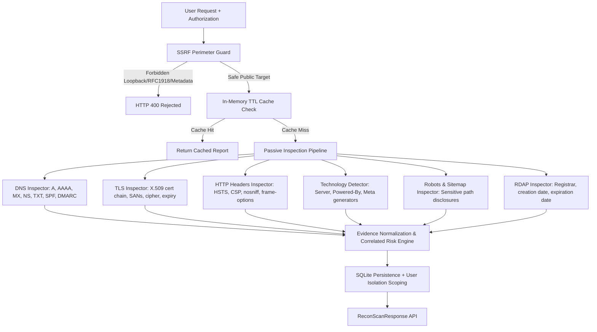

# NeuroCraft Defensive Passive Reconnaissance Engine

**Module**: `services/recon-engine`  
**API Endpoints**: `/api/v1/recon`  
**Philosophy**: Defensive, Passive, Safe, Evidence-Based, Permission-Aware  

---

## 1. Core Principles & Safety Mandates

NeuroCraft's reconnaissance engine provides non-intrusive digital attack surface intelligence for authorized defenders and security analysts.

### Strict Defensive Non-Offensive Guarantee
- **Zero Exploitation**: Never delivers payloads, invokes exploit scripts, or leverages known CVEs against targets.
- **Zero Intrusive Scanning**: Never performs port flooding, TCP SYN sweeps, or brute-force directory fuzzing.
- **Zero Password Attacks**: Never tests credentials or attempts unauthorized authentication bypass.
- **Zero Recursive Crawling**: Ordinary HTTP queries are strictly restricted to root endpoints (`/`), `/robots.txt`, and `/sitemap.xml` with hard body size limits (64 KB – 128 KB) and bounded redirect chains (max 3 redirects).
- **Mandatory User Authorization**: Scans require explicit confirmation (`authorization_confirmed = true`) in the request payload and persisted in SQLite.

---

## 2. Supported Target Formats

The engine accepts:
1. **Domain Names**: e.g., `cloudflare.com`, `example.org`
2. **Subdomains / Hostnames**: e.g., `api.service.internal`, `sub.example.com`
3. **Public IP Addresses**: IPv4 and IPv6 public addresses (e.g., `93.184.216.34`, `2606:4700:4700::1111`)

---

## 3. Architecture & Inspection Pipeline

---

## 4. Passive Data Sources

### A. Passive DNS Records & Email Spoofing Protections
- Queries public DNS resolvers for `A`, `AAAA`, `MX`, `NS`, `TXT`, and `CNAME` records.
- Evaluates domain email spoofing defense:
  - **SPF (`v=spf1`)**: Confirms authorized sending hosts. Flags overly permissive policies (`+all`).
  - **DMARC (`_dmarc.<domain>`)**: Confirms policy presence to reject fraudulent impersonation.

### B. Passive TLS / HTTPS Inspection
- Establishes a standard TLS handshake on port 443 with socket timeout (3.5s).
- Parses the peer X.509 certificate using Python's `cryptography` engine:
  - Common Name (Subject) and Certificate Authority (Issuer)
  - Subject Alternative Names (SANs) recorded as discovered subdomain assets
  - Validity start, expiration date, and active `is_expired` status
  - Negotiated protocol version (`TLSv1.3`, `TLSv1.2`) and cipher suite
  - Flags outdated protocols (TLS 1.0, TLS 1.1) and self-signed certificates

### C. HTTP Security Headers
- Non-intrusively queries `https://<target>` (and falls back to `http://<target>`):
  - `Strict-Transport-Security` (HSTS): Mitigates man-in-the-middle protocol downgrades
  - `Content-Security-Policy` (CSP): Mitigates cross-site scripting (XSS) and code injection
  - `X-Frame-Options`: Mitigates clickjacking framing attacks
  - `X-Content-Type-Options: nosniff`: Prevents MIME confusion
  - `Referrer-Policy`: Restricts referrer data leakage across origins

### D. Conservative Technology Detection
- Passively infers web servers, runtimes, and frameworks from response headers and root HTML metadata:
  - Servers: Nginx, Apache, Caddy, Microsoft IIS, Cloudflare
  - Runtimes: PHP, Express.js / Node.js, ASP.NET
  - Frameworks: Next.js, React, Nuxt.js, WordPress
  - Outputs calibrated confidence scores ($0.70$ to $0.95$) without claiming unverified certainty.

### E. Robots.txt and Sitemap Inspection
- Fetches `/robots.txt` and `/sitemap.xml` with max 128 KB response cap.
- Checks whether `Disallow:` directives inadvertently disclose naming patterns of administrative interfaces (`/admin`, `/backend`, `/api/internal`) or backup files (`.sql`, `.bak`).

### F. Public RDAP Domain Information
- Queries standard RDAP endpoints (`https://rdap.org/domain/<target>`) over HTTPS.
- Extracts registrar organization, registration date, expiration date, and authoritative nameservers.

---

## 5. SSRF Perimeter Protection

The engine strictly defends against Server-Side Request Forgery (SSRF) at two stages:
1. **Pre-Flight DNS Resolution & IP Check**:
   Before initiating any socket or HTTP connection, the target hostname is resolved to IPv4 and IPv6 addresses.
   The addresses are tested against disallowed network ranges:
   - Loopback: `127.0.0.0/8`, `::1/128`, `localhost`
   - RFC 1918 Private: `10.0.0.0/8`, `172.16.0.0/12`, `192.168.0.0/12`
   - Link-Local: `169.254.0.0/16`, `fe80::/10`
   - Cloud Metadata Services: `169.254.169.254`, `metadata.google.internal`, `instance-data`
   - Multicast & Carrier-Grade NAT: `224.0.0.0/4`, `100.64.0.0/10`
2. **Redirect Hook Validation**:
   `httpx` client uses an asynchronous `safe_redirect_hook` that validates the destination of every intermediate HTTP `301/302/307/308` redirect, preventing open redirect SSRF bypasses.

---

## 6. Exposure Scoring & Separate Confidence

### Deterministic Exposure Formula
$$Score = \min\left(100.0, \sum_{category} \min\left(\text{CategoryScore}, \text{CategoryCap}\right)\right)$$

| Severity | Weight |
|---|---|
| `CRITICAL` | 35.0 |
| `HIGH` | 20.0 |
| `MEDIUM` | 12.0 |
| `LOW` | 6.0 |
| `INFO` | 2.0 |

**Category Caps**:
- `DNS`: Max 30.0 points
- `TLS`: Max 40.0 points
- `HEADERS`: Max 30.0 points
- `EXPOSURE`: Max 20.0 points

**Exposure Level Thresholds**:
- `0.0 – 19.9`: **SAFE** (Minimal public attack surface, valid TLS, SPF/DMARC active)
- `20.0 – 39.9`: **LOW** (Minor informational issues such as missing referrer policy)
- `40.0 – 69.9`: **MEDIUM** (Missing email spoofing protection or missing HSTS/CSP)
- `70.0 – 89.9`: **HIGH** (Expired certificate, outdated TLS 1.0, or permissive SPF `+all`)
- `90.0 – 100.0`: **CRITICAL** (Multiple compounding critical exposure vectors)

### Independent Confidence Assessment
- `HIGH` ($\ge 0.80$): Complete resolution across DNS, TLS, and HTTP services.
- `MEDIUM` ($0.50 – 0.79$): Partial response (e.g. DNS succeeded, but port 443 closed).
- `LOW` ($< 0.50$): Target offline or multiple network timeouts encountered.

---

## 7. Database Persistence & User Isolation

### Database Tables (SQLite)
- `recon_scans`: Stores scan metadata, target, authorization flag, exposure score, confidence, and JSON dumps.
- `recon_assets`: Stores discovered infrastructure assets (IPs, mail servers, nameservers, SAN subdomains).
- `recon_findings`: Stores exposure observations with category, severity, recommendation, source, and verified evidence.

### Multi-Tenant Isolation
All database queries enforce strict ownership filtering:
- User A can only retrieve and delete scans where `user_id == user_a.id`.
- User B cannot access User A's scans (returns `404 Not Found`).
- Unauthenticated requests cannot access any authenticated user's scans.

---

## 8. Offline & Network Failure Behavior

- If DNS resolution or internet connectivity is unavailable, the engine gracefully handles socket and DNS exceptions.
- It returns `status = "COMPLETED"` or `"LIMITED"`, documents the exact limitations in `limitations`, sets confidence to `LOW`, and never fabricates simulated data.
- Cached results are served if queried within the 10-minute TTL window with `cached: true`.
- Firebase cloud synchronization is strictly non-blocking and optional.
