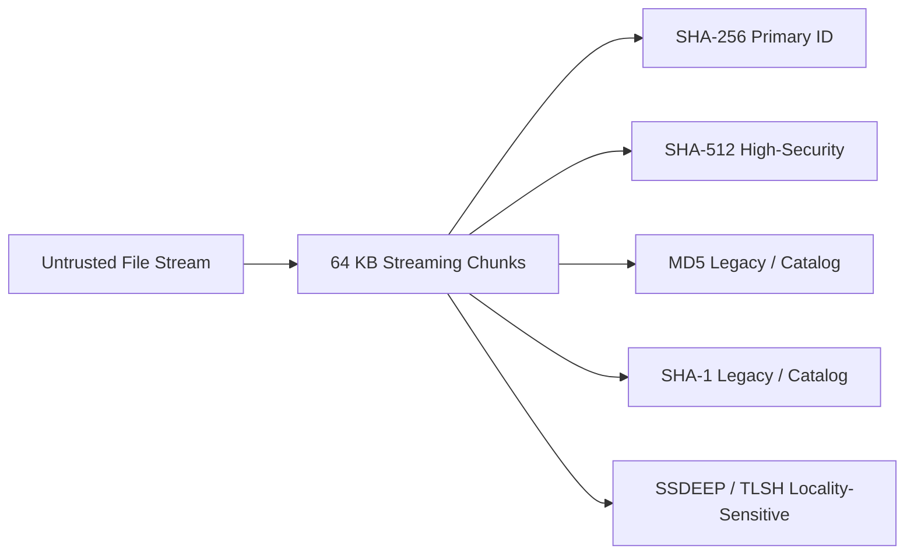
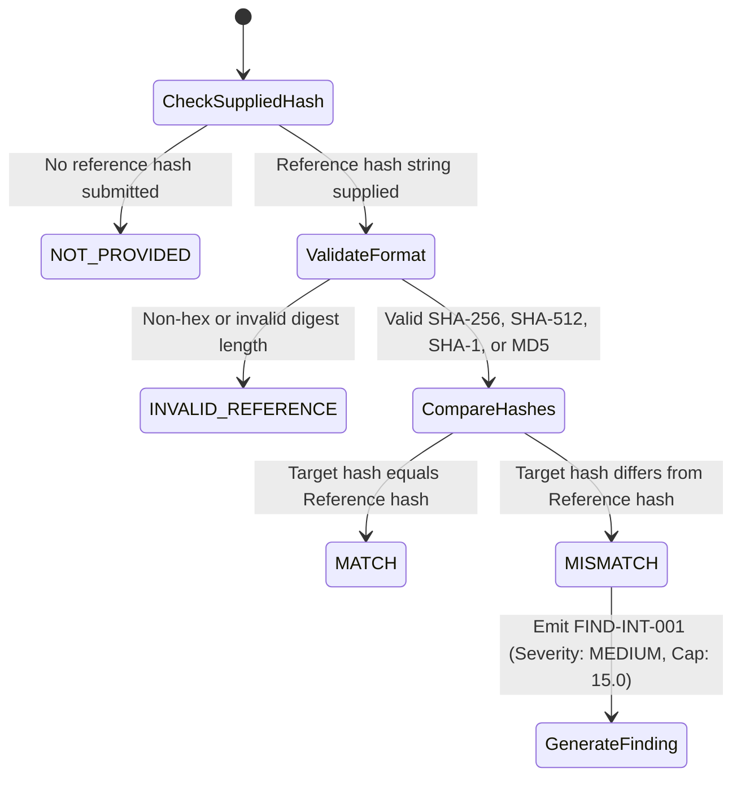

# NeuroCraft Trust & File Integrity Engine

**Module**: `services/scanner` (`neurocraft_scanner.trust`, `neurocraft_scanner.fingerprint`)  
**API Endpoints**: `/api/v1/scans`, `/api/v1/scans/{scan_id}/integrity`, `/api/v1/scans/{scan_id}/trust`  
**Database Table**: `file_integrity` (Migration `005_trust_and_integrity`)  
**Philosophy**: Evidence-Based, Zero Trust Hallucinations, Safe Defaults, Offline-First  

---

## 1. Core Principles & Philosophy

NeuroCraft decouples **Risk Evaluation** (malicious behavioral capabilities and evasion signals) from **Trust & Integrity Assessment** (cryptographic provenance, digital signatures, and binary identity).

### Fundamental Postulates
1. **"Unknown" is NOT "Malicious"**: If a file format does not natively support signatures or a publisher certificate cannot be verified offline, the file is classified with safe defaults (`NEUTRAL` or `UNSIGNED`), not penalized as malware.
2. **Unsigned is NOT Malicious**: Open-source tools, scripts, text files, and custom utilities are frequently unsigned. They receive `NOT_APPLICABLE` or `UNSIGNED` without inflating threat scores.
3. **Changed Hash is NOT Automatically Malware**: A reference hash mismatch indicates that a file was modified, patched, or corrupted. It generates an `INTEGRITY` finding capped at 15 points (Medium severity), preventing false-positive critical alarms.
4. **Deterministic Evidence Scoring**: Trust scores (0–100) and confidence values are computed strictly from factual, verifiable attributes (cryptographic hash matches, authentic certificates, structural validity). They are never randomized or hallucinated by generative models.

---

## 2. Cryptographic Fingerprinting Architecture

All cryptographic hashing runs in a **single-pass streaming chunk pipeline** (`services/scanner/src/neurocraft_scanner/fingerprint.py`) reading 64 KB blocks from disk or memory buffers. This ensures zero file execution and zero memory bloat even for multi-gigabyte files.



### Hash Functions & Designated Roles
| Algorithm | Key Length | Status | Usage in NeuroCraft |
| :--- | :--- | :--- | :--- |
| **SHA-256** | 256 bits (32 bytes) | **Primary Standard** | Primary scan identifier, database index, Merkle proofs, reference verification |
| **SHA-512** | 512 bits (64 bytes) | **High-Assurance** | FIPS/high-security environments and cryptographic reference checks |
| **SHA-1** | 160 bits (20 bytes) | **Legacy / Catalog Only** | Legacy threat intelligence and VirusTotal catalog matching; deprecated for collision safety |
| **MD5** | 128 bits (16 bytes) | **Legacy / Catalog Only** | Legacy catalog lookups; collision-vulnerable, never used for cryptographic assurance |

---

## 3. Reference Hash Verification Matrix

Users can supply an expected baseline hash via API (`reference_hash`) or web interface to verify file fidelity.



| Reference Match Status | Meaning | Integrity Status Result | Trust Impact |
| :--- | :--- | :--- | :--- |
| `MATCH` | Cryptographic match against user-provided reference digest | `UNCHANGED` or `VERIFIED` | **+25 points** (Confidence +0.20) |
| `MISMATCH` | Cryptographic mismatch: file altered, patched, or substituted | `MISMATCH` | **-40 points** (Finding `FIND-INT-001`) |
| `NOT_PROVIDED` | User did not supply a baseline reference hash | Safe default (`UNSIGNED`, `SIGNED`, etc.) | **0 points** (Neutral baseline) |
| `INVALID_REFERENCE` | Input reference was malformed or unsupported format | Safe default | **0 points** (Flagged in evidence log) |

---

## 4. Digital Signature & Certificate Analysis

NeuroCraft statically parses signatures without executing untrusted binaries. Parsers extract ASN.1 structures, PKCS#7 envelopes, and X.509 certificate chains.

### Supported File Formats
1. **Windows PE (`.exe`, `.dll`, `.sys`)**:
   - Inspects `IMAGE_DIRECTORY_ENTRY_SECURITY` in PE headers.
   - Extracts WinCertificate structures and Authenticode PKCS#7 signatures.
   - Verifies whether binary content matches the signed digest and parses the root/intermediate certificate attributes.
2. **Android Packages (`.apk`)**:
   - Detects JAR signing (v1 Scheme) via `META-INF/*.RSA` or `*.DSA`.
   - Inspects the APK Signing Block for APK Signature Scheme v2/v3 blocks.
3. **Adobe PDF (`.pdf`)**:
   - Statically locates signature dictionaries (`/Type /Sig`, `/ByteRange`, `/Contents`).
   - Verifies byte range coverage and embedded certificate chains.
4. **Unsigned & Document Formats (`.txt`, `.csv`, `.json`, `.png`, `.py`, `.sh`)**:
   - Accurately labeled `NOT_APPLICABLE` (or `UNSIGNED`).
   - Never penalized or flagged as suspicious.

### Extracted X.509 Certificate Fields
- **Subject**: Common Name (CN), Organization (O), Organizational Unit (OU), Country (C).
- **Issuer**: Authority Name, Issuing CA, Country.
- **Validity Window**: `valid_from` and `valid_to` timestamps with expiration warnings.
- **Serial Number & Key Algorithms**: RSA, ECDSA, DSA, and digest algorithms (SHA-256, SHA-384, SHA-512).

---

## 5. Deterministic Integrity State Machine

```
              ┌───────────────────────────┐
              │     File Format Check     │
              └─────────────┬─────────────┘
                            │
         ┌──────────────────┴──────────────────┐
         │ Native Signature Supported?         │
         ▼                                     ▼
        Yes                                   No
         │                                     │
   ┌─────┴──────────────┐             ┌────────┴──────────────┐
   │ Signature Present? │             │ Reference Hash Given? │
   └───┬──────────┬─────┘             └───┬─────────────┬─────┘
      Yes         No                     Yes            No
       │          │                       │              │
       │     ┌────┴──────────────┐     ┌──┴──────┐       │
       │     │ Reference Hash?   │     │ Match?  │       │
       │     └───┬─────────┬─────┘     ├──┬───┬──┤       │
       │        Yes        No          │  │   │  │       │
       │         │          │         Yes │  No  │       ▼
       ▼         ▼          ▼          │  │   │  │ ┌───────────────┐
  ┌────────┐ ┌────────┐ ┌────────┐     │  │   │  └─┤NOT_APPLICABLE │
  │ SIGNED │ │MATCH / │ │UNSIGNED│     │  │   │    └───────────────┘
  │ or     │ │MISMATCH│ └────────┘     │  │   │
  │VERIFIED│ └────────┘                │  │   ▼
  └────────┘                           │  │ ┌──────────────┐
                                       │  └─┤   MISMATCH   │
                                       │    └──────────────┘
                                       ▼
                               ┌──────────────┐
                               │  UNCHANGED   │
                               └──────────────┘
```

### State Definitions
- `VERIFIED`: Digital signature is cryptographically valid and authentic, or matches reference.
- `UNCHANGED`: Cryptographic hash matches the provided trusted reference hash.
- `MISMATCH`: Cryptographic hash differs from the user-supplied reference hash.
- `SIGNED`: Digital signature present; valid certificate structure extracted (offline evaluation).
- `UNSIGNED`: Valid executable/binary format without an embedded digital signature.
- `UNKNOWN`: Format supports signatures but parser encountered corrupted tables.
- `NOT_APPLICABLE`: Format does not natively support digital signatures (plain text, JSON, images, scripts).

---

## 6. Evidence-Based Trust Scoring

NeuroCraft scores Trust on a scale from **0.0 to 100.0**:

$$\text{Trust Score} = \mathrm{clamp}\left(50.0 + \sum \text{Evidence Impact Weights},\, 0.0,\, 100.0\right)$$

### Trust Categories & Levels
| Trust Score Range | Trust Level | Description |
| :--- | :--- | :--- |
| **85.0 – 100.0** | `VERY_HIGH` | Verified digital signature from trusted publisher and/or matching reference hash |
| **70.0 – 84.9** | `HIGH` | Valid signature present, valid certificate chain, no known tampering |
| **40.0 – 69.9** | `NEUTRAL` | Unsigned binary or non-executable format; no evidence of tampering or special provenance |
| **20.0 – 39.9** | `LOW` | Expired certificate, self-signed certificate on untrusted binary, or unverified publisher |
| **0.0 – 19.9** | `VERY_LOW` | Cryptographic reference hash mismatch or invalid/corrupted digital signature |

### Deterministic Evidence Weighting Rules
| Evidence Code | Factor | Score Delta | Confidence Delta |
| :--- | :--- | :--- | :--- |
| `EVID-INT-REF-MATCH` | Reference hash matches analyzed file | **+25.0** | +0.20 |
| `EVID-INT-REF-MISMATCH`| Reference hash does NOT match file | **-40.0** | +0.30 |
| `EVID-INT-SIG-VALID` | Digital signature verified authentic | **+30.0** | +0.25 |
| `EVID-INT-SIG-PRESENT`| Digital signature present (offline chain) | **+15.0** | +0.15 |
| `EVID-INT-CERT-EXPIRED`| Signing certificate has expired | **-15.0** | +0.10 |
| `EVID-INT-SIG-INVALID`| Digital signature digest mismatch / corrupted | **-35.0** | +0.25 |
| `EVID-INT-UNSIGNED` | Executable format has no signature | **-10.0** | +0.05 |
| `EVID-INT-NOT-APPL` | Format does not support signatures | **0.0** | 0.00 |

---

## 7. Database Persistence & Isolation

Integrity reports are persisted to SQLite table `file_integrity` linked to the primary `scans` table.

```sql
CREATE TABLE file_integrity (
    integrity_id VARCHAR(64) PRIMARY KEY,
    scan_id VARCHAR(64) NOT NULL UNIQUE REFERENCES scans(scan_id) ON DELETE CASCADE,
    sha256 VARCHAR(64) NOT NULL,
    sha512 VARCHAR(128) NOT NULL,
    md5 VARCHAR(32) NOT NULL,
    sha1 VARCHAR(40) NOT NULL,
    reference_hash VARCHAR(128),
    hash_match_status VARCHAR(32) NOT NULL DEFAULT 'NOT_PROVIDED',
    integrity_status VARCHAR(32) NOT NULL DEFAULT 'UNKNOWN',
    trust_level VARCHAR(32) NOT NULL DEFAULT 'NEUTRAL',
    trust_score FLOAT NOT NULL DEFAULT 50.0,
    is_signed BOOLEAN NOT NULL DEFAULT 0,
    signature_valid BOOLEAN NOT NULL DEFAULT 0,
    publisher VARCHAR(256),
    issuer VARCHAR(256),
    certificate_valid_from TIMESTAMP,
    certificate_valid_to TIMESTAMP,
    is_expired BOOLEAN NOT NULL DEFAULT 0,
    evidence_json TEXT NOT NULL DEFAULT '[]',
    created_at TIMESTAMP NOT NULL DEFAULT CURRENT_TIMESTAMP
);
CREATE INDEX idx_file_integrity_scan ON file_integrity(scan_id);
CREATE INDEX idx_file_integrity_sha256 ON file_integrity(sha256);
```

---

## 8. API Specification

### Upload & Scan with Reference Hash
`POST /api/v1/scans`
- **Form Data**:
  - `file`: UploadFile (required)
  - `reference_hash`: string (optional, 32/40/64/128 hex chars)

### Get Dedicated Integrity Report
`GET /api/v1/scans/{scan_id}/integrity`
- **Response**: `FileIntegrityReport`

### Get Trust Assessment
`GET /api/v1/scans/{scan_id}/trust`
- **Response**: `TrustAssessment`

---

## 9. Verification & Quality Gates

The implementation is verified by 112 automated unit and integration tests:
- `tests/unit/test_trust_integrity.py`: 12 unit tests covering all permutations of reference matching, certificate parsing, signature corruption, and trust scoring.
- `tests/integration/test_integrity_api.py`: 4 integration tests verifying end-to-end API ingestion, database persistence, and retrieval.
- `apps/web`: TypeScript production build validated with `npm run build` (0 errors).
