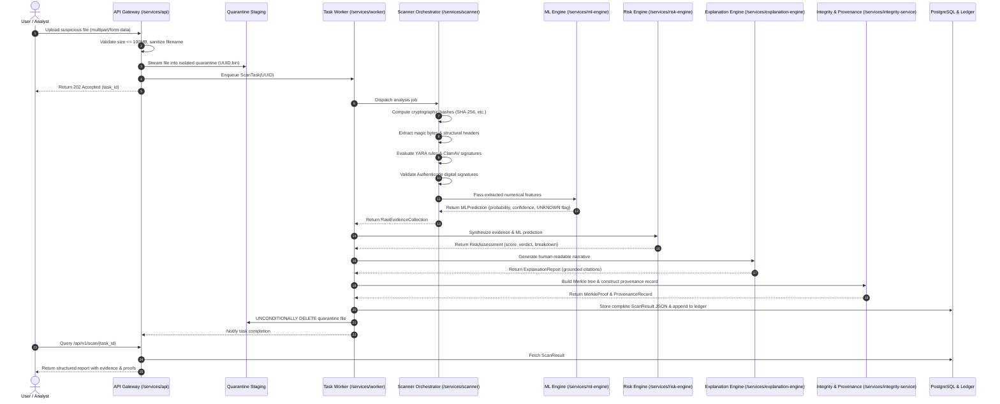

# Data Flow Architecture

**Document**: `docs/architecture/data-flow.md`  
**Status**: Architecture Baseline (Phase 0)

---

## 1. End-to-End Scan Lifecycle

The complete lifecycle of a file scanned by NeuroCraft follows a strict sequential pipeline:

---

## 2. Retention Policy

* **Raw File Artifacts**: Deleted immediately after step 14.
* **Evidence & Hash Manifests**: Retained in PostgreSQL and local append-only ledger for historical auditability and threat correlation.
