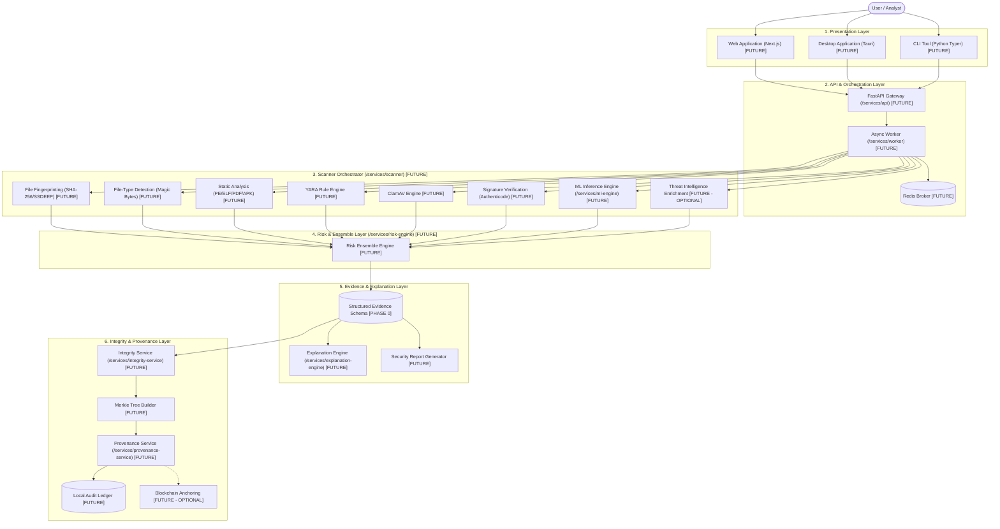

# System Overview Architecture

**Project**: NeuroCraft  
**Tagline**: *Detect. Verify. Prove.*  
**Status**: Initial Architecture Specification (Phase 0)

---

## 1. High-Level Concept

NeuroCraft is a multi-tier cybersecurity file inspection and cryptographic provenance platform. It reconciles deterministic security controls (signatures, rules, hashes) with probabilistic machine learning classifiers and explainable AI narratives, all anchored into a tamper-evident audit ledger.

---

## 2. Layer Definitions

### 1. Presentation Layer [FUTURE]
* **Web**: React / Next.js browser client with dashboard visualizer and drag-and-drop quarantine upload.
* **Desktop**: Tauri + Rust lightweight client for offline SOC analysts.
* **CLI**: Command-line tool for headless script automation and developer workstations.

### 2. API & Ingress Layer [FUTURE]
* Serves OpenAPI 3.1 endpoints, validates authorization tokens, handles streaming multipart uploads with body size quotas, and pushes jobs to the task queue.

### 3. Scanner Orchestrator [FUTURE]
* Isolates untrusted files, extracts byte signatures, computes cryptographic and fuzzy hashes, parses structured headers, checks YARA rules, invokes ClamAV, and feeds feature vectors to the ML engine.

### 4. Risk Ensemble Engine [FUTURE]
* Synthesizes findings from all static engines. Weighs deterministic evidence against probabilistic ML scores to yield a calibrated 0–100 risk score and verdict (`CLEAN`, `SUSPICIOUS`, `MALICIOUS`, `UNKNOWN`).

### 5. Evidence & Explanation Layer [FUTURE]
* Stores fine-grained findings and uses local language models or rule-based templates to generate grounded, explainable summaries citing exact evidence IDs.

### 6. Integrity & Provenance Layer [FUTURE]
* Builds deterministic Merkle trees from evidence items, issues cryptographic inclusion proofs, maintains a local append-only transparency ledger, and optionally anchors batch roots to a decentralized network.
