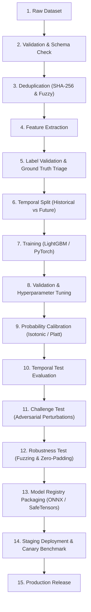

# Machine Learning Training Pipeline & Model Families

**Document**: `docs/ml/training.md`  
**Status**: Architecture & Lifecycle Specification (Phase 0)

---

## 1. Intended Future Training Lifecycle

All machine learning models developed for NeuroCraft follow a rigorous, tamper-resistant training pipeline designed to eliminate data leakage and ensure real-world generalization:

### Stage Details

1. **Dataset Ingestion**: Acquisition of legitimate research corpora (e.g. EMBER, SOREL).
2. **Validation**: Verification of file integrity and licensing compatibility.
3. **Deduplication**: Pruning exact hash duplicates and fuzzy duplicates ($>95\%$ SSDEEP similarity).
4. **Feature Extraction**: Deterministic extraction of numerical feature tensors.
5. **Label Validation**: Cross-validation of AV labels using majority-voting heuristics.
6. **Temporal Split**: Partitioning datasets strictly by first-seen dates to prevent forward-looking data leakage.
7. **Training**: Model fitting using CPU-friendly gradient boosted trees or compact deep nets.
8. **Validation**: Hyperparameter tuning on the chronological validation split.
9. **Calibration**: Isotonic regression or Platt scaling to ensure output probabilities represent true empirical risk.
10. **Temporal Test**: Final holdout evaluation simulating deployment against newly emergent variants.
11. **Challenge Test**: Evaluation against adversarial perturbations (byte padding, benign section injection).
12. **Robustness Test**: Testing stability against malformed headers, negative offsets, and truncated files.
13. **Model Registry**: Export to ONNX format with cryptographic SHA-256 digest and metadata manifest.
14. **Staging**: Validation in integration staging environments.
15. **Production**: Packaged for inference in `services/ml-engine`.

---

## 2. Planned Model Families (Future)

NeuroCraft plans to support 10 specialized model families across different inspection domains:

1. **PE Static Model**: Gradient boosted tree (LightGBM) over tabular PE header, entropy, and import features.
2. **PE Deep / Raw-Byte Model**: Compact 1D convolutional network operating directly on raw byte prefixes.
3. **PDF Model**: Random Forest / MLP classifying structural object graphs and JavaScript stream flags in PDF files.
4. **APK Model**: Classifier evaluating Android manifest permissions, intent filters, and DEX bytecode hashes.
5. **ELF Model**: Linux binary classifier inspecting ELF header flags, dynamic symbols, and section permissions.
6. **Document Model**: Heuristic and ML classifier detecting malicious VBA macros and OLE stream anomalies.
7. **Malware Family Classifier**: Multi-class classifier predicting specific threat families (e.g., Ransomware, InfoStealer, Loader, RAT).
8. **Behavior / Indicator Classifier**: Multi-label classifier mapping static indicators to MITRE ATT&CK techniques.
9. **Evasion Detector**: Specialized classifier detecting anti-debugging, anti-VM, packing (UPX, Themida), and header corruption.
10. **Ensemble / Meta-Model**: Top-level meta-learner aggregating individual model outputs with deterministic rules.

---

## 3. Phase 0 Notice

* **No models are trained or downloaded in Phase 0.**
* Model implementations will begin in Phase 3 under strict resource and safety constraints.
